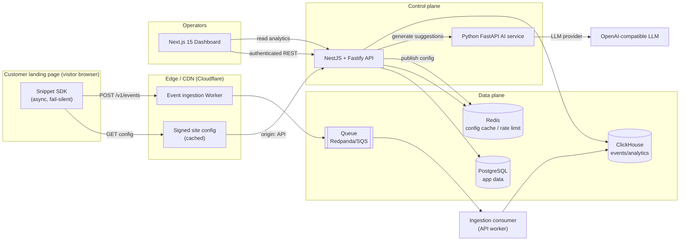

# Architecture — Landing Optimizer

> Status: Living document. Last updated: 2026-07-02.

## 1. System overview

Landing Optimizer is a multi-tenant SaaS composed of five independently
deployable services (multi-repo). The public snippet is loaded by customer
landing pages; events flow through an edge ingestion layer into a queue, then
into ClickHouse for analytics. The control plane (NestJS API) manages tenants,
sites, experiments, approvals, and serves signed site configuration through
Redis + CDN. An AI service produces CRO suggestions that require human
approval before any experiment can run.

## 2. Components

| Repo | Runtime | Responsibility |
| --- | --- | --- |
| `landing-optimizer-snippet` | TS → vanilla JS (tsup/esbuild) | Public SDK: tracking, DOM map, experiment overlay, anti-flicker. |
| `landing-optimizer-api` | NestJS + Fastify (Node 20) | Control plane: auth, tenants, sites, experiments, approvals, config signing, analytics read, ingestion consumer. |
| `landing-optimizer-ai` | Python 3.12 + FastAPI | LLM provider abstraction, CRO suggestion generation, scoring. |
| `landing-optimizer-dashboard` | Next.js 15 + React 19 + TS | Operator UI. |
| `landing-optimizer-infra` | Docker/Terraform/K8s/CI | Local dev, staging, prod, CDN, migrations, observability. |

### 2.1 Ingestion path
The edge Worker validates origin + payload shape, attaches a coarse geo/device
category (derived, never stored raw), strips anything PII-shaped, and enqueues
batches. A consumer in the API tier writes to ClickHouse using async inserts.
The edge never has database credentials.

### 2.2 Config delivery
Site configuration (active experiments, allocation, guardrails, sampling) is
compiled by the API, **signed** (Ed25519), cached in Redis, and served through
the CDN with short TTL + stale-while-revalidate. The SDK verifies the signature
public key baked into the loader before applying any experiment.

### 2.3 AI path
The API calls the AI service over an internal, mTLS/JWT-protected channel with a
structured prompt built from aggregated analytics + sanitized page map. The AI
returns structured JSON (validated) that becomes `ai_suggested` experiments.
No experiment is applied without transitioning through `approved`.

## 3. Multi-tenancy & isolation

- Every app-DB row carries `tenant_id`; all queries are scoped by a tenant
  guard + Prisma middleware; PostgreSQL Row-Level Security policies enforce at
  the database boundary.
- ClickHouse events carry `tenant_id` + `site_id`; analytics queries always
  filter by both, injected server-side (never from client input).
- Site config is namespaced by `siteId`; origin allowlist enforced at edge.

## 4. Data model boundaries

- **PostgreSQL** (source of truth, relational): tenants, users, memberships,
  sites, experiments, variants, approvals, audit log, guardrails, api keys.
- **ClickHouse** (append-only, high volume): raw pseudonymous events + roll-up
  materialized views for funnels, section performance, and experiment stats.
- **Redis**: signed config cache, rate-limit counters, dedup/session salt.

## 5. Scalability

- Stateless API replicas behind a load balancer; horizontal pod autoscaling.
- Edge ingestion scales independently (serverless / Workers).
- Queue decouples ingestion spikes from ClickHouse write throughput.
- ClickHouse partitioned by day + tenant; TTL on raw events, rollups retained.
- Redis for hot config; CDN absorbs config read traffic.

## 6. Failure modes & resilience

| Failure | Behavior |
| --- | --- |
| Backend/API down | Snippet fails silently; page renders normally. |
| Config fetch fails | SDK runs analytics-only, no experiments applied. |
| Signature invalid | SDK ignores config (never applies untrusted variants). |
| Queue backpressure | Edge sheds load / samples; returns 202 fast. |
| ClickHouse slow | Consumer buffers + retries with backoff; async inserts. |
| AI provider down | Suggestions deferred; dashboard shows degraded state. |

## 7. Observability

OpenTelemetry traces across API + AI; Prometheus metrics (RED + ingestion
lag + experiment exposure counts); Grafana dashboards; Sentry for errors.
Structured JSON logs with `tenant_id`/`site_id`/`trace_id` (never PII).

## 8. Technology decisions (ADR summary)

| Decision | Choice | Rationale |
| --- | --- | --- |
| API framework | NestJS + Fastify | Structured DI, fast HTTP, TS-first. |
| App DB | PostgreSQL + Prisma | Relational integrity, RLS, migrations. |
| Analytics DB | ClickHouse | Columnar, high-ingest, cheap aggregation. |
| Queue | Redpanda (dev) / SQS (AWS) | Kafka API, simple ops; SQS managed on AWS. |
| Edge | Cloudflare Workers | Global low-latency ingestion + CDN config. |
| SDK build | tsup (esbuild) | Tiny bundle, tree-shaking, IIFE output. |
| Dashboard | Next.js 15 App Router | RSC, streaming, mature ecosystem. |
| AI | FastAPI + provider abstraction | Swap LLM vendors; Python AI ecosystem. |
| Auth | Auth.js (dashboard) + JWT (services) | Standard, flexible. |

See other docs: [DATABASE_SCHEMA.md](./DATABASE_SCHEMA.md),
[API_CONTRACTS.md](./API_CONTRACTS.md), [EVENT_SCHEMA.md](./EVENT_SCHEMA.md),
[SECURITY.md](./SECURITY.md), [DEPLOYMENT.md](./DEPLOYMENT.md).
