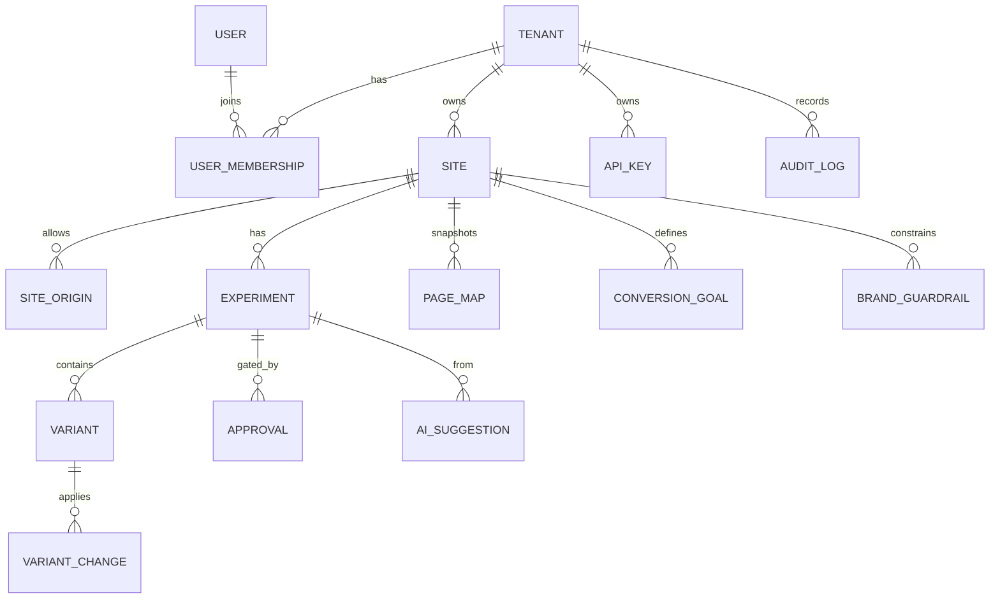

# Database Schema — Landing Optimizer

> Status: Living document. Last updated: 2026-07-02.
> Two stores: **PostgreSQL** (relational app data) and **ClickHouse**
> (append-only analytics). No PII is stored in either.

## 1. PostgreSQL (app data)

Managed with Prisma. Every tenant-scoped table has `tenant_id` and is protected
by Row-Level Security (RLS). Timestamps are `timestamptz`. IDs are UUID v7
(time-ordered) generated app-side.

### 1.1 Entity relationship



### 1.2 Tables

#### tenant
| column | type | notes |
| --- | --- | --- |
| id | uuid PK | tenant id |
| name | text | display name |
| slug | citext unique | url slug |
| plan | text | `free` \| `pro` \| `enterprise` |
| data_region | text | e.g. `eu` / `us` |
| created_at / updated_at | timestamptz | |

#### user
| column | type | notes |
| --- | --- | --- |
| id | uuid PK | |
| email | citext unique | login identity (operator, not visitor) |
| name | text | |
| created_at / updated_at | timestamptz | |

> Note: `user.email` is operator/account data, not visitor PII. Visitor data is
> never linked to users.

#### user_membership
| column | type | notes |
| --- | --- | --- |
| id | uuid PK | |
| tenant_id | uuid FK | |
| user_id | uuid FK | |
| role | text | `owner` \| `admin` \| `editor` \| `viewer` |
| created_at | timestamptz | |
| | | unique(tenant_id, user_id) |

#### site
| column | type | notes |
| --- | --- | --- |
| id | uuid PK | public `siteId` used by snippet |
| tenant_id | uuid FK | |
| name | text | |
| primary_domain | text | |
| public_key | text | Ed25519 public key (config verify) |
| private_key_enc | bytea | encrypted signing key (KMS) |
| ingest_key | text | public write key embedded in snippet |
| sampling_rate | numeric | 0..1 |
| status | text | `active` \| `paused` |
| settings | jsonb | send-structural-metadata flags, etc. |
| created_at / updated_at | timestamptz | |

#### site_origin
| column | type | notes |
| --- | --- | --- |
| id | uuid PK | |
| site_id | uuid FK | |
| origin | text | exact origin allowlist entry |
| created_at | timestamptz | |
| | | unique(site_id, origin) |

#### api_key (service / programmatic access)
| column | type | notes |
| --- | --- | --- |
| id | uuid PK | |
| tenant_id | uuid FK | |
| name | text | |
| hashed_key | text | Argon2id hash, never plaintext |
| scopes | text[] | least-privilege scopes |
| last_used_at | timestamptz | |
| revoked_at | timestamptz | nullable |

#### conversion_goal
| column | type | notes |
| --- | --- | --- |
| id | uuid PK | |
| site_id | uuid FK | |
| name | text | goal name used by `conversion()` |
| kind | text | `event` \| `url` \| `form_submit` |
| matcher | jsonb | rule |
| created_at | timestamptz | |

#### experiment
| column | type | notes |
| --- | --- | --- |
| id | uuid PK | |
| tenant_id | uuid FK | |
| site_id | uuid FK | |
| name | text | |
| hypothesis | text | |
| status | text | enum (see workflow) |
| type | text | `copy`\|`cta`\|`headline`\|`subheadline`\|`button_style`\|`section_order`\|`section_visibility`\|`layout_class` |
| targeting | jsonb | query-param, device rules |
| allocation | numeric | traffic % to experiment (0..1) |
| primary_goal_id | uuid FK | conversion goal |
| risk_score | int | 0..100 |
| winner_variant_id | uuid | nullable |
| created_by | uuid FK user | |
| created_at / updated_at | timestamptz | |
| started_at / ended_at | timestamptz | nullable |

Status enum: `draft`, `ai_suggested`, `pending_review`, `approved`,
`scheduled`, `running`, `paused`, `completed`, `rejected`, `rolled_back`.

#### variant
| column | type | notes |
| --- | --- | --- |
| id | uuid PK | |
| experiment_id | uuid FK | |
| name | text | e.g. `control`, `v1` |
| is_control | boolean | |
| weight | numeric | split within experiment |
| created_at | timestamptz | |

#### variant_change (the actual DOM mutation)
| column | type | notes |
| --- | --- | --- |
| id | uuid PK | |
| variant_id | uuid FK | |
| selector | text | CSS selector (validated, safe) |
| op | text | `set_text`\|`set_html_safe`\|`set_attr`\|`add_class`\|`remove_class`\|`reorder`\|`hide`\|`show` |
| original_value | text | for rollback |
| proposed_value | text | new content (sanitized) |
| attr_name | text | nullable |
| created_at | timestamptz | |

#### approval
| column | type | notes |
| --- | --- | --- |
| id | uuid PK | |
| experiment_id | uuid FK | |
| status | text | `pending`\|`approved`\|`rejected` |
| reason | text | reviewer note |
| risk_score | int | snapshot |
| checklist | jsonb | required approval checklist state |
| screenshot_url | text | nullable evidence |
| approver_user_id | uuid FK | nullable until decided |
| decided_at | timestamptz | nullable |
| created_at | timestamptz | |

#### ai_suggestion
| column | type | notes |
| --- | --- | --- |
| id | uuid PK | |
| tenant_id | uuid FK | |
| site_id | uuid FK | |
| kind | text | `hypothesis`\|`headline`\|`cta`\|`friction`\|`section`\|`score`\|`plan` |
| payload | jsonb | structured AI output |
| model | text | provider/model id |
| expected_impact | text | qualitative/quantitative |
| risk_level | text | `low`\|`medium`\|`high` |
| experiment_id | uuid FK | nullable, once materialized |
| created_at | timestamptz | |

#### brand_guardrail
| column | type | notes |
| --- | --- | --- |
| id | uuid PK | |
| site_id | uuid FK | |
| rules | jsonb | tone, banned words, max length, must-keep claims |
| created_at / updated_at | timestamptz | |

#### page_map (sanitized structural snapshot)
| column | type | notes |
| --- | --- | --- |
| id | uuid PK | |
| site_id | uuid FK | |
| url_path | text | path only, no query/PII |
| map | jsonb | sections, selectors, text hashes/snippets |
| captured_at | timestamptz | |

#### audit_log
| column | type | notes |
| --- | --- | --- |
| id | uuid PK | |
| tenant_id | uuid FK | |
| actor_user_id | uuid | nullable (system) |
| action | text | e.g. `experiment.approved` |
| target_type | text | |
| target_id | text | |
| metadata | jsonb | before/after summary (no PII) |
| ip_hash | text | salted hash only |
| created_at | timestamptz | |

### 1.3 Row-Level Security
Every tenant-scoped table enables RLS with a policy:
`USING (tenant_id = current_setting('app.tenant_id')::uuid)`. The API sets
`app.tenant_id` per request inside a transaction after authenticating.

## 2. ClickHouse (analytics)

### 2.1 events (raw, pseudonymous, append-only)
```sql
CREATE TABLE events (
  event_date        Date,
  event_time        DateTime64(3),
  tenant_id         UUID,
  site_id           UUID,
  session_id        String,          -- short-lived, daily-salted, non-PII
  event_name        LowCardinality(String),
  page_path         String,          -- path only, query stripped
  referrer_host     LowCardinality(String),
  device_category   LowCardinality(String),  -- mobile/tablet/desktop
  browser_category  LowCardinality(String),
  country           LowCardinality(String),  -- only if legally safe, else ''
  is_bot            UInt8,
  experiment_id     UUID,            -- 0 if none
  variant_id        UUID,            -- 0 if none
  section_id        LowCardinality(String),
  scroll_depth      UInt8,           -- bucketed 0..100
  dwell_ms          UInt32,
  value             Float64,         -- generic numeric (e.g. goal value)
  props             String           -- sanitized JSON, size-capped, no PII
) ENGINE = MergeTree
PARTITION BY (toYYYYMMDD(event_time), tenant_id)
ORDER BY (tenant_id, site_id, event_name, event_time)
TTL event_date + INTERVAL 180 DAY;   -- raw retention window
```

### 2.2 Rollup materialized views
- `mv_daily_funnel` — counts by `event_name` per site/day.
- `mv_section_performance` — visibility, dwell, dead/rage clicks per section.
- `mv_experiment_stats` — exposures + conversions per experiment/variant/day
  (feeds significance calculation).

```sql
CREATE MATERIALIZED VIEW mv_experiment_stats
ENGINE = SummingMergeTree
PARTITION BY event_date
ORDER BY (tenant_id, site_id, experiment_id, variant_id, event_date) AS
SELECT
  event_date, tenant_id, site_id, experiment_id, variant_id,
  countIf(event_name = 'exposure')            AS exposures,
  countIf(event_name = 'conversion')          AS conversions,
  sumIf(value, event_name = 'conversion')     AS conversion_value
FROM events
WHERE experiment_id != toUUID('00000000-0000-0000-0000-000000000000')
GROUP BY event_date, tenant_id, site_id, experiment_id, variant_id;
```

### 2.3 Retention & privacy
- Raw events TTL 180 days; rollups retained longer.
- `session_id` is derived from a **daily-rotated salt** and never leaves the
  edge in raw form; it cannot be linked across days or sites.
- No column stores raw IP, email, name, phone, or free-form user input.

## 3. Migrations
- PostgreSQL: Prisma Migrate (`prisma/migrations`).
- ClickHouse: SQL migration files in `landing-optimizer-api/clickhouse/migrations`
  applied by an idempotent runner.
